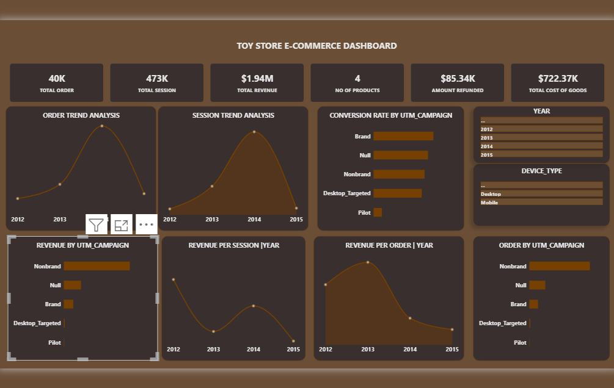

# Toy Store E-Commerce — Commercial Analytics

A Power BI case study analysing e-commerce performance across **orders, website sessions, revenue, refunds, campaign performance, device type and yearly trends**.

[View the full portfolio case study](https://mayfuns.github.io/mariam-analytics-portfolio/toy-store.html)

## Project overview

This project turns e-commerce transaction and website-session data into a concise commercial performance view.

The dashboard brings together order volume, traffic, revenue, refunds, cost of goods and campaign-level performance so commercial trends can be reviewed in one place.

## Business question

**What is driving e-commerce performance, which acquisition campaigns contribute most, and how do orders, sessions and revenue change over time?**

## Headline metrics

| KPI | Result |
| --- | ---: |
| Total orders | **40K** |
| Total sessions | **473K** |
| Total revenue | **$1.94M** |
| Number of products | **4** |
| Amount refunded | **$85.34K** |
| Cost of goods | **$722.37K** |

## Tools and skills

- Power BI
- Power Query
- Data modelling
- E-commerce analytics
- Sales analysis
- Campaign analysis
- KPI design
- Dashboard design
- Data storytelling

## Analysis areas

### Orders and sessions
Tracks order and session trends across the reporting period.

### Revenue performance
Reviews total revenue, revenue per session and revenue per order.

### Campaign performance
Compares orders, revenue and conversion across UTM campaign groups.

### Device and time filters
Allows performance to be explored by year and device type.

### Refunds and cost
Brings refunded value and cost of goods into the headline commercial view.

## What this project demonstrates

- Translating transactional and web-session data into business KPIs.
- Combining acquisition, sales and revenue measures in one report.
- Using Power BI for time-based and campaign-level comparisons.
- Designing a compact commercial dashboard for stakeholder review.

## Portfolio

- [Portfolio homepage](https://mayfuns.github.io/mariam-analytics-portfolio/)
- [Toy Store full case study](https://mayfuns.github.io/mariam-analytics-portfolio/toy-store.html)
- [GitHub profile](https://github.com/Mayfuns)

---

**Mariam Adetoyi**  
Data Analyst | Business Intelligence | Commercial Analytics
